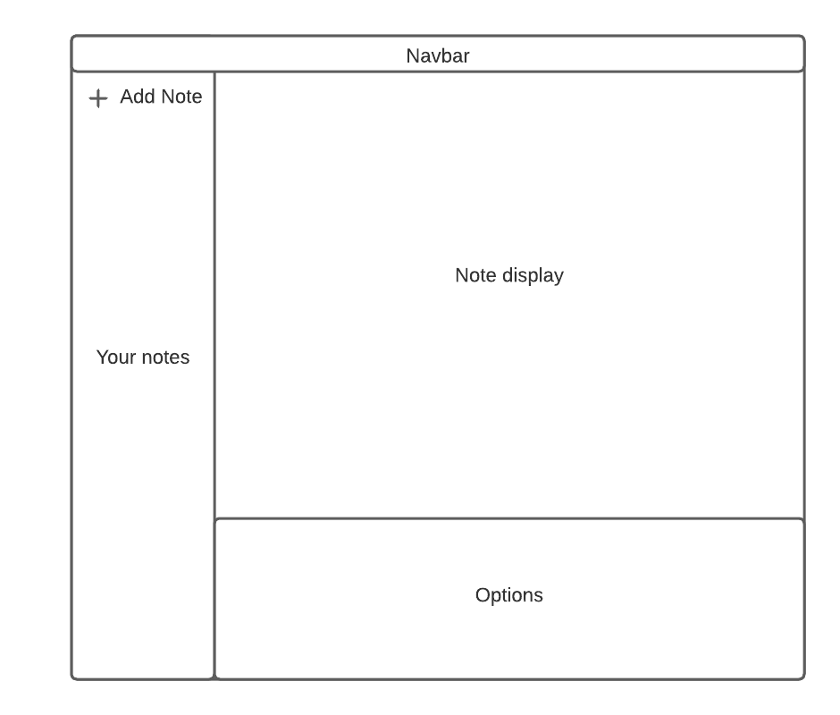

<h2 align="center">Pepper</h2>

  

    A note keeping application, with the abilities to add check lists and reminders 
     
  

<!-- TABLE OF CONTENTS -->

  
Table of Contents

  <ol>
    <li>
      <a href="#about-the-project">About The Project</a>
      <ul>
        <li><a href="#built-with">Built With</a></li>
      </ul>
    </li>
    <li>
      <a href="#getting-started">Getting Started</a>
      <ul>
        <li><a href="#prerequisites">Prerequisites</a></li>
      </ul>
    </li>
  </ol>

<!-- ABOUT THE PROJECT -->
## About The Project

(<a href="#top">back to top</a>)

### Built With
* [MongoDB](https://www.mongodb.com/atlas/database)
* [ExpressJS](https://expressjs.com/)
* [ReactJS](https://reactjs.org/)
* [NodeJS](https://nodejs.org/en/)
* [Bootstrap](https://getbootstrap.com)

(<a href="#top">back to top</a>)

